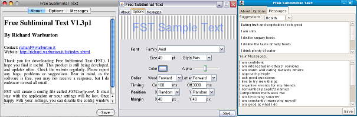

# Free Subliminal Text

## Not maintained
This project is no longer maintained. It hasn't been updated in years, so I have put the
source code online, hoping someone will bring it back to life.

## Summary
Free Subliminal Text (FST), flashes subliminal messages on screen. The default settings use very quick flashes of partially transparent text in random screen locations. Most of the time you shouldn't notice it is running, however, you can make what it does, more or less obvious. FST is still being developed so check back for updates.

## Feature List
* Completely Free - No hoops to jump through, yours forever.
* Font Control - Font family, size, style, color and transparency are all configurable.
* Text Control - Have each message's words or letters reversed or randomized.
* Placement Control - Left-Top to Right-Bottom, plus random and margin options.
* Message Control - Drag and drop suggestions are available, but any message inside Your Messages can be edited.
* Multiplatform - Windows at work, Mac and/or Linux (think Asus EEE) at home? No problem. FST runs on any platform Java (JRE 1.6+) does.

## Requirements
* Java 1.6+ must be installed.

## Setup
The application FST.jar can be put anywhere. Bear in mind that it will try to create a config file called FSTConfig.xml in the same location.
Configuration

Configuring should be straight forward using the provided config window. Closing of the window will quit FST, so you may want to minimise it when not in use. For those who like XML or want to disable the config window from appearing at start up may want to edit FSTConfig.xml directly.

## Download
* [FST1.42.jar](releases/FST1.42.jar)
* [FST1.41.jar](releases/FST1.41.jar)
* [FST1.40.jar](releases/FST1.40.jar)

## Trouble Shooting

### I can't see anything, I don't think it is working

Hopefully, it is working, but it may be too subtle for your consciousness (or screen). Click the Placement tab and change both x and y locations to "center". Try increasing the timing display. Still can't see it, increase the font alpha (up to 255).

## Notes

### Linux
If FST.jar opens in archive manager instead of executing, right-click and select "Open with Other Application", choose "Use a custom command" and type "java -jar". The window manager should remember for next time. 

## New Features drafted for future releases
* More documentation on About Tab
* Add additional built-in messages - Suggestions anyone?

## Release History
### 1.50 - 2014-03-01
* Switched to native transparency.
* Now requires Java 1.6.
* Now only saves config on clean exit.
* Fix - message order no longer lost between loads.

### 1.42 - 2013-04-19
* Fix divide by zero error.
* Initial "Test Message" added for first time users.

### 1.41 - 2011-09-01
* Add message order option.
* Fixed user save directory.

### 1.40
* Added minimize on startup option.
* Removed save button - now autosaves.
* Interface tweaks
* Check for updates option - check every 30 days after install.
* Friendly window close dialog with minimize option.
* Fixed paste in message window.
* Now saves valid XML when messages contain special characters.

### 1.3p1
* Added Word and Letter Order options.
* Simplified GUI with a single tab for all options.
* Replaced quit button with enabling window close and adding quit dialog.
* First version uploaded to download sites

### 1.2
* Added GUI

### 1.01
* Bugfix?: Memory Leak? - Now Flushes image data after each flash so we don't keep using up ram whilst waiting for garbage collection.

### 1.0
* 5kb GUI-less program, simply displayed text from xml file.